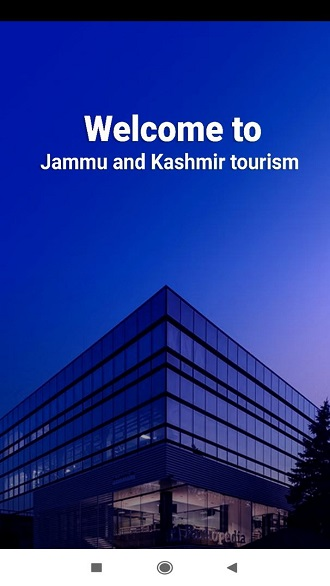
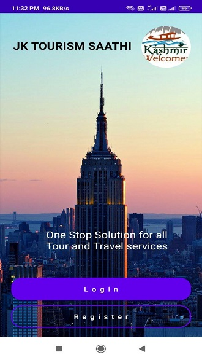
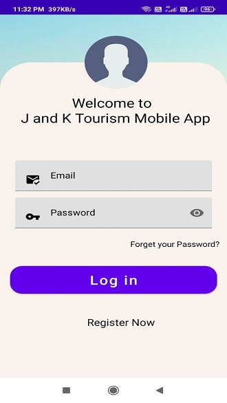

# JKTOURISM-SAATHI

## Introduction

This is project is aimed to provide an One Stop solution for tourists/visitors a Website and Android Application facility where user will get all the required Tour and Travel Services like category wise registered Hotels, Houseboats,Shikaras, Tour & Travel Operators,Tour Guides,Operating in the Kashmir Valley one of the topmost Tourist destination of world.Users from all over the country and world can book,cancel and get updates about any booking Services anytime. This facility also includes SOS Button that helps the Visitor to Track & register his/her complaints and Queries regarding any services online and it will help the concerned department to smartly manage all the Travel Services at one place.It also provides some feasible suggestions & recommendations for tourists that may prove valuable for them and save their time and Mone

## Modules
- ***Hotels***
- ***Houseboats***
- ***Shikaras***
- ***Travel Guides***
- ***Travel Agencies & operators

## Technologies Used
- Front End: HTML, CSS, Bootstrap, JavaScript.
- Back End:Android-Java
- Database: Firebase Realtime database.
 

|:----------------------------------------:|:-----------------------------------------:|:-----------------------------------------: |

|  |  |  |

